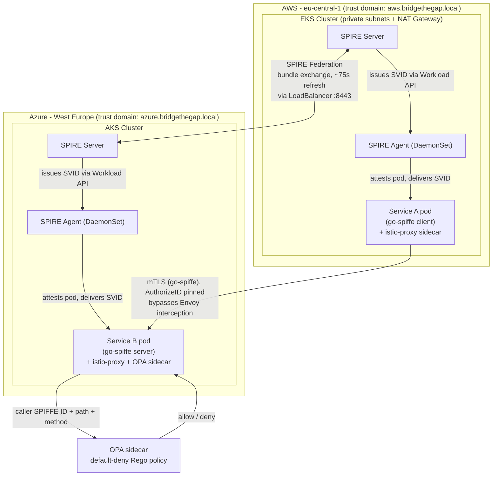
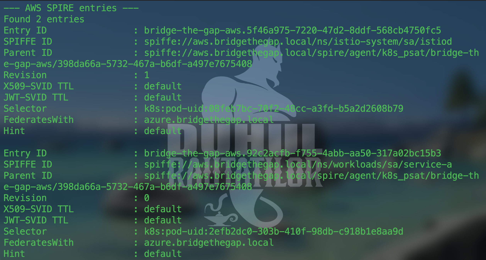

<a id="top"></a>

<div align="center">

# Bridge the Gap: Cross-Cloud Workload Identity (AWS to Azure)

**A service in AWS calls a service in Azure with zero static credentials.**
Identity, not secrets. SPIFFE/SPIRE issues it, mutual TLS enforces it, OPA authorizes it.


</div>

---

### Contents

- [Architecture](#architecture)
- [Completion Criteria](#completion-criteria)
- [Identities Issued](#identities-issued)
- [Trust Relationship Between Environments](#trust-relationship-between-environments)
- [How Authentication Works](#how-authentication-works)
- [Proof: Successful Authenticated Call](#proof-successful-authenticated-call)
- [Bonus Challenge 1: Workload Attestation](#bonus-challenge-1-workload-attestation)
- [Bonus Challenge 2: Authorization Policy](#bonus-challenge-2-authorization-policy)
- [Bonus Challenge 3: Observability](#bonus-challenge-3-observability)
- [Challenges Encountered](#challenges-encountered)
- [Additional Negative Test: Identity Spoofing](#additional-negative-test-identity-spoofing)
- [Post-Delivery Hardening Pass](#post-delivery-hardening-pass)
- [Known Limitations (Honest Assessment)](#known-limitations-honest-assessment)
- [Infrastructure Teardown](#infrastructure-teardown)

---

## Architecture



Both clusters run a full Istio control plane and SPIRE deployment, but the actual Service A to Service B call is **not** proxied by Envoy. That's a deliberate architecture decision, explained under "Why application-level mTLS" below.

<p align="right"><a href="#top">back to top ↑</a></p>

## Completion Criteria

All four completion criteria from the assignment are met, with direct evidence, before anything below this section:

1. **Service A (AWS) successfully calls the Azure service endpoint.** See [Proof: Successful Authenticated Call](#proof-successful-authenticated-call).
2. **Authentication is performed using workload identity and mTLS.** See [How Authentication Works](#how-authentication-works) and [Identities Issued](#identities-issued).
3. **No static credentials are stored anywhere.** No API keys, passwords, or long-lived tokens in either cluster. Identities are short-lived X.509-SVIDs fetched on demand via the SPIFFE Workload API. Confirmed at runtime, not just by design: zero `Secret` objects exist in either cluster's `workloads` namespace, and the only volumes mounted into Service A/B are the SPIFFE Workload API socket (ephemeral, SPIRE-rotated) and a ConfigMap holding the OPA policy text.
4. **If identity verification is disabled or the service lacks the correct identity, the request fails.** Two independent proofs: no client certificate at all is rejected during the TLS handshake (see [Proof](#proof-successful-authenticated-call)), and a valid-but-wrong identity is also rejected during the TLS handshake, before OPA or any application logic runs (see [Additional Negative Test: Identity Spoofing](#additional-negative-test-identity-spoofing)).

Everything from [Additional Negative Test: Identity Spoofing](#additional-negative-test-identity-spoofing) onward goes beyond what the assignment requires: extra verification and a security hardening pass done after the fact, on top of an already-complete deliverable.

<p align="right"><a href="#top">back to top ↑</a></p>

## Identities Issued

| Workload | Trust domain | SPIFFE ID | Issued via |
|---|---|---|---|
| Service A (AWS) | `aws.bridgethegap.local` | `spiffe://aws.bridgethegap.local/ns/workloads/sa/service-a` | k8s node attestation (`k8s_psat`) plus k8s workload attestor matching namespace/ServiceAccount/pod label |
| Service B (Azure) | `azure.bridgethegap.local` | `spiffe://azure.bridgethegap.local/ns/workloads/sa/service-b` | same mechanism, Azure SPIRE server |
| Istio sidecars (both clusters) | respective trust domain | `spiffe://<domain>/ns/<namespace>/sa/<service-account>` | `ClusterSPIFFEID` `istio-sidecar-reg`, matches pods labeled `spiffe.io/spire-managed-identity: "true"` |
| Istio ingress gateway (Azure) | `azure.bridgethegap.local` | `spiffe://azure.bridgethegap.local/ns/istio-system/sa/istio-ingressgateway` | `ClusterSPIFFEID` `istio-ingressgateway-reg` (not used in the Service A to B call path; part of the standard mesh install) |

All identities are X.509-SVIDs with short TTLs, rotated automatically by SPIRE. Nothing here is a static secret. No API key, password, or long-lived token is stored anywhere in either cluster or in the application code.

**Proof from SPIRE itself** (registration entries: what SPIRE is actually configured to issue, not just what the application logs claim):




Both sides show `FederatesWith: <the other cloud's trust domain>` on every entry. That's SPIRE's own record of the federation relationship, not something asserted only in application code.

<details>
<summary><strong>Reproduce this proof yourself</strong> (click to expand)</summary>

```bash
# AWS
kubectl config use-context <your-aws-context>
kubectl exec -n spire-server spire-server-0 -c spire-server -- /opt/spire/bin/spire-server entry show

# Azure
kubectl config use-context <your-azure-context>
kubectl exec -n spire-server spire-server-0 -c spire-server -- /opt/spire/bin/spire-server entry show
```

</details>

<p align="right"><a href="#top">back to top ↑</a></p>

## Trust Relationship Between Environments

**Proof of automatic, periodic bundle refresh** (not a one-time static exchange; this is what makes the trust relationship dynamic rather than a shared secret):


<details>
<summary><strong>Reproduce this proof yourself</strong> (click to expand)</summary>

```bash
kubectl config use-context <your-aws-context>
kubectl logs -n spire-server spire-server-0 -c spire-server --tail=300 | grep -i "bundle refresh" | tail -5
```

</details>

Each cloud runs its own independent SPIRE server with its own trust domain and root CA. The two clouds aren't naturally aware of each other. Trust between them is established through **SPIRE Federation**:

1. Each SPIRE server exposes a federation bundle endpoint (`spire-server-federation-lb`, a Kubernetes `LoadBalancer` Service), which serves that server's current trust bundle (its root CA certificates) over an mTLS-protected endpoint.
2. A `ClusterFederatedTrustDomain` resource on each side points at the other cloud's bundle endpoint.
3. Bootstrapping this relationship required one manual, trust-on-first-use exchange (`spire-server bundle set` / `bundle show`). That's the one moment a human had to vouch for the initial trust, standard practice for federation setup and similar to exchanging root certificates between two independent PKIs.
4. After bootstrap, each SPIRE server automatically re-fetches and refreshes the peer's bundle on its own (observed interval: about 75 seconds), so certificate rotation on either side never breaks trust. No manual re-exchange is ever needed again.

The practical effect: Service B's SPIRE server trusts AWS's root CA (and can therefore validate Service A's certificate), and Service A's SPIRE server trusts Azure's root CA, entirely through this dynamic bundle exchange, never through a shared static secret.

<p align="right"><a href="#top">back to top ↑</a></p>

## How Authentication Works

**1. Node attestation.** Every SPIRE agent proves to its SPIRE server that it's running on a legitimate node in the cluster, using the `k8s_psat` (Kubernetes Projected Service Account Token) attestor. The node presents a token bound to the Kubernetes API server, which SPIRE validates against the cluster's own token review API. This ties node identity to something Kubernetes itself vouches for, not to network location (IP/hostname), which is spoofable and ephemeral in cloud environments.

**2. Workload attestation.** Once an agent is trusted, it attests the workloads running on it using the k8s workload attestor. For every pod requesting an identity, SPIRE inspects the pod's actual namespace, ServiceAccount, and labels (via the container runtime / kubelet) and matches them against the selectors declared in a `ClusterSPIFFEID` resource. Only pods matching `spiffe.io/spire-managed-identity: "true"` in the `workloads` namespace, with the expected ServiceAccount, receive an SVID for `service-a` or `service-b`. A pod can't claim an identity it doesn't structurally match. There's no shared secret a compromised pod could steal and reuse elsewhere.

**3. SVID issuance.** SPIRE issues each workload a short-lived X.509-SVID over the SPIFFE Workload API (a Unix domain socket, `csi.spiffe.io`, mounted read-only into the pod). The workload never sees or handles a static key it could leak. It fetches short-lived key material on demand and SPIRE rotates it automatically.

**4. Mutual TLS at the application layer.** Both Service A and Service B use `go-spiffe/v2` directly. Service A opens an mTLS client via `tlsconfig.MTLSClientConfig`, Service B serves via `tlsconfig.MTLSServerConfig`. Each side requires the peer's certificate to resolve to one exact expected SPIFFE ID (`tlsconfig.AuthorizeID`), not merely "any SPIFFE identity" (`AuthorizeAny`, which would be a serious authorization gap). Both directions are mutually authenticated: Service B only accepts connections from `spiffe://aws.bridgethegap.local/ns/workloads/sa/service-a`, and Service A only trusts a server presenting `spiffe://azure.bridgethegap.local/ns/workloads/sa/service-b`.

**5. Authorization (OPA).** Passing the mTLS handshake only proves identity. It doesn't decide what a caller may do. Service B extracts the caller's verified SPIFFE ID from the TLS peer certificate and asks an OPA sidecar (bound to `localhost:8181`, unreachable outside the pod) to evaluate a Rego policy against `{spiffe_id, path, method}`. The policy is a default-deny allow-list: only `GET /hello` from `service-a`'s exact identity is permitted, `/admin` is denied regardless of caller. The application fails closed if OPA is unreachable.

### Why application-level mTLS, not an Istio-native mesh hop

The initial plan was to let Envoy terminate mTLS for this call, using Istio's SPIFFE integration end-to-end. In practice, Istio's SDS-based certificate distribution (via istio-agent) only requests and serves its own fixed trust bundle vocabulary (`default`/`ROOTCA`) and doesn't automatically merge an additional SPIFFE-federated trust domain's CA into Envoy's validation context. That's a genuine integration gap between vanilla Istio sidecar injection and SPIFFE Federation, not a misconfiguration on our side. Fixing it properly would require a custom `EnvoyFilter` with a statically pre-combined CA bundle, which is real production engineering but goes beyond this project's stated scope ("mutual TLS authentication between services", not "Envoy must terminate every hop"). We deliberately descoped that path and instead terminate SPIFFE mTLS natively in the application via `go-spiffe`, which satisfies every stated completion criterion without the added complexity. Istio and its sidecars remain fully deployed and functioning for identity issuance to the mesh's own components. They just aren't the enforcement point for this specific cross-cloud hop.

<p align="right"><a href="#top">back to top ↑</a></p>

## Proof: Successful Authenticated Call

**The real certificate served by Service B**, extracted directly from the network, not from application code or logs. Note the SPIFFE URI in the Subject Alternative Name and a validity window of about four hours, not months or years:


<details>
<summary><strong>Reproduce this proof yourself</strong> (click to expand)</summary>

```bash
echo | openssl s_client -connect <service-b-external-ip>:8080 -showcerts 2>/dev/null \
  | openssl x509 -noout -text \
  | grep -A2 "Subject Alternative Name\|Not Before\|Not After"
```

</details>

Both services also log their own verified SPIFFE identity on startup:

```
Service A identity: spiffe://aws.bridgethegap.local/ns/workloads/sa/service-a
Service B identity: spiffe://azure.bridgethegap.local/ns/workloads/sa/service-b
```

Calling through Service A's test endpoint (which triggers the outbound mTLS call to Service B): `/hello` succeeds, and the restricted `/admin` path is denied by the OPA policy for the same authenticated identity.


OPA's decision log for those same two requests, showing the actual input evaluated (caller identity, path, method) and the resulting decision:


<details>
<summary><strong>Reproduce this proof yourself</strong> (click to expand)</summary>

```bash
kubectl port-forward -n workloads deploy/service-a 18080:8080 &
curl -s http://localhost:18080/call-service-b
curl -s http://localhost:18080/call-service-b-admin

kubectl config use-context <your-azure-context>
kubectl logs -n workloads -l app=service-b -c opa --tail=10
```

</details>

**Negative test (completion criterion #4):** a client presenting no certificate at all is rejected during the TLS handshake itself, before any HTTP request is even processed. `curl` fails with `SSL routines::tlsv13 alert certificate required`. Identity isn't optional here. The connection can't be established at all without it, let alone reach the authorization layer.


<details>
<summary><strong>Reproduce this proof yourself</strong> (click to expand)</summary>

```bash
curl -v -k https://\<service-b-external-ip\>:8080/hello
```

</details>

<p align="right"><a href="#top">back to top ↑</a></p>

## Additional Negative Test: Identity Spoofing

> [!NOTE]
> This test goes beyond the "no client certificate" case already documented above. It proves that mTLS enforcement is based on cryptographic identity (SPIFFE ID bound to a SPIRE-issued SVID), not just "is TLS present."

**Setup**: a workload running under a *different* Kubernetes ServiceAccount in the same `workloads` namespace (so it still receives a valid SPIRE-issued SVID via the default `ClusterSPIFFEID`, just with a different SPIFFE ID than `spiffe://aws.bridgethegap.local/ns/workloads/sa/service-a`) attempts to call Service B directly.

**Expected result**: Service B's `tlsconfig.AuthorizeID(clientID)` pins the TLS handshake to the exact expected SPIFFE ID. A different, valid, SPIRE-issued identity is still rejected — proving the check is identity-based, not merely "any valid SPIRE cert accepted."

<details>
<summary>Reproduce this test</summary>

A throwaway `imposter-sa` ServiceAccount and a pod using the exact same image, port, environment variables, and SPIFFE Workload API CSI volume as `service-a` were deployed into the `workloads` namespace on the AWS cluster. The default fallback `ClusterSPIFFEID` has no `podSelector`, so SPIRE still issues it a valid SVID, just under a different SPIFFE ID (`spiffe://aws.bridgethegap.local/ns/workloads/sa/imposter-sa`) than the one Service B is pinned to (`spiffe://aws.bridgethegap.local/ns/workloads/sa/service-a`).

```bash
kubectl apply -f imposter-pod.yaml
kubectl wait --for=condition=Ready pod/imposter -n workloads --timeout=60s
kubectl port-forward pod/imposter 8080:8080 -n workloads &
curl -v -m 15 http://localhost:8080/call-service-b
```

Actual result:

```
< HTTP/1.1 502 Bad Gateway
call to service-b failed: Get "https://<service-b-ip>:8080/hello": remote error: tls: bad certificate
```

Service B rejected the connection with a `tls: bad certificate` alert during the TLS handshake itself, before the HTTP request was ever processed by the application or OPA. This confirms `tlsconfig.AuthorizeID` enforces the exact expected SPIFFE ID, not merely "any valid SPIRE-issued certificate."


</details>

## Bonus Challenge 1: Workload Attestation

Already covered in detail under "How Authentication Works", steps 1 and 2. In summary: **node attestation** uses `k8s_psat`, and **workload attestation** uses the k8s workload attestor matching namespace, ServiceAccount, and pod labels, driven declaratively by `ClusterSPIFFEID` resources (managed in Terraform, see `terraform/aws/spire.tf` and `terraform/azure/spire.tf`).

This mechanism was chosen over cloud-metadata-based attestation (like AWS/Azure instance identity documents) because it's Kubernetes-native and portable across both clouds with the same logic. The same attestation model applies whether the cluster runs on AWS or Azure, which matters directly for a cross-cloud project. It also ties identity to attributes Kubernetes RBAC already governs (namespace, ServiceAccount), rather than to network-layer facts (IP, hostname) that are ephemeral and, in a compromised-node scenario, potentially attacker-influenced.

<p align="right"><a href="#top">back to top ↑</a></p>

## Bonus Challenge 2: Authorization Policy

Implemented and verified (see "Proof" above). `/hello` is allowed for `service-a`'s exact SPIFFE identity, `/admin` is denied unconditionally. Enforcement is via an **OPA sidecar** (Policy Decision Point) plus a Go middleware in Service B (Policy Enforcement Point), rather than an Istio `AuthorizationPolicy`. That's a direct consequence of the architecture decision above: Envoy doesn't terminate this port's mTLS, so it can't see the HTTP path to apply an `AuthorizationPolicy` against. That enforcement point would be a structural no-op given how this hop is secured. OPA was chosen specifically because the assignment names it as a valid alternative mechanism to Istio-native authorization.

<p align="right"><a href="#top">back to top ↑</a></p>

## Bonus Challenge 3: Observability

**Not implemented.** Kiali visualizes mesh traffic by observing what Envoy proxies. Because the authenticated Service A to Service B call deliberately bypasses Envoy interception (`traffic.sidecar.istio.io/excludeInboundPorts`) so the application can terminate SPIFFE mTLS natively, Kiali wouldn't show this specific hop even if deployed. It would only show mTLS between other in-mesh components (sidecar-to-istiod, ingress gateway), which isn't the interesting call for this project. Attempting it would have produced a dashboard that looked like it demonstrated something it didn't. Left out rather than built as a hollow checkbox.

<p align="right"><a href="#top">back to top ↑</a></p>

## Challenges Encountered

- **SPIRE Federation bootstrap** required understanding the distinction between the one-time manual trust-on-first-use bundle exchange and the ongoing automatic refresh. Easy to conflate the two at first.
- **Infrastructure drift into raw `kubectl`**: the `ClusterSPIFFEID` registrations were initially applied by hand outside Terraform. Caught and brought under IaC (`terraform import` on Azure, fresh resources on AWS) so the whole platform layer stays declarative. Application workloads (Service A/B deployments, the OPA ConfigMap) stay on `kubectl` deliberately, not by oversight: infra changes rarely and belongs in Terraform, workloads change on every image bump and belong in CI/CD instead.
- **Cross-trust-domain mTLS validation gap in Istio/SPIFFE Federation**: extensively debugged (`remote error: tls: unknown certificate`), root-caused to Istio's SDS proxy not merging federated CA bundles into Envoy's validation context. Explored a full `EnvoyFilter` plus static combined-bundle fix, then deliberately stepped back from it as over-engineering relative to the actual assignment scope, landing on application-level SPIFFE mTLS instead.
- **Docker image architecture mismatch**: Docker Desktop on Apple Silicon builds `arm64` images by default, but both EKS and AKS nodes run `amd64`, causing `ErrImagePull: no match for platform in manifest`. Fixed by building explicitly with `--platform linux/amd64`.
- **Terraform drift on Azure**: an externally-injected `created-on` tag (very likely a subscription-level Azure Policy) and an undeclared `default_node_pool.upgrade_settings` block both caused `terraform plan` to show phantom changes on every run. Fixed with a scoped `lifecycle { ignore_changes }` for the tag and by declaring the block's actual default values. `terraform plan` now reports "No changes" on both clouds.
- **Azure Load Balancer health probes** initially looked like suspicious repeated TLS handshake failures in Service B's logs. Confirmed via node/pod IP correlation that they were the LB's own bare-TCP health check hitting a TLS-only port. Benign, not a security signal.

<p align="right"><a href="#top">back to top ↑</a></p>

## Post-Delivery Hardening Pass

After the core requirements above were met, a follow-up pass was done to identify and close any additional weak points without changing the stable architecture. Three items were evaluated:

> [!TIP]
> **Pod `securityContext` hardening — applied.** `service-a`, `service-b`, and their containers were updated with `readOnlyRootFilesystem: true`, `allowPrivilegeEscalation: false`, `runAsNonRoot: true`, `runAsUser: 65532` (the numeric UID of the distroless `nonroot` user), `seccompProfile.type: RuntimeDefault`, and `capabilities.drop: [ALL]`. Verified live on both clusters (`kubectl get pod -o jsonpath` showing the applied `securityContext`) and functionally (a real authenticated call to `/call-service-b` still returns `200` after the change).


> [!WARNING]
> **Pod Security Admission `restricted` label — evaluated, not applied.** Enabling the `restricted` Pod Security Standard on the `workloads` namespace was tested against the live `istio-init` container injected by classic (non-CNI) sidecar injection. That container runs as root and requires `NET_ADMIN`/`NET_RAW` capabilities to install the iptables redirect rules — both of which `restricted` disallows. Applying this label would have broken every future pod rollout in the namespace. Decision: do not apply, since the assignment explicitly asked to avoid changes that affect stable operation. Documented here as a known gap rather than silently skipped.


> [!WARNING]
> **SPIRE agent kubelet certificate verification (`workloadAttestors.k8s.verification.type: auto`) — attempted, reverted.** The current setting (`skip`) does not verify the kubelet's serving certificate when the agent attests workloads, which is a real (if narrow) local-trust gap. Switching to `auto` was tested live on one AWS node; the `gather-host-cert` init container failed because the node's kubelet serving certificate has no `localhost` SAN, blocking `spire-agent` from starting. The failure was contained to a single node (of two), diagnosed with `helm history` / `helm get values` / `helm template`, and fully reverted via `kubectl replace` plus a clean `terraform apply`. Both agents confirmed `1/1 Running` and a real authenticated call confirmed still working before closing this out. Left at `skip` to avoid the instability this introduces on the current kubelet cert setup.


## Known Limitations (Honest Assessment)

> [!WARNING]
> **Permissive default identity.** The catch-all `ClusterSPIFFEID` (`spire-server-spire-default`) has `fallback: true` and no `podSelector`, meaning it issues a SPIFFE ID to *any* pod scheduled into a non-system namespace, not just `service-a`/`service-b`. This is a SPIRE chart default, not something introduced by this project, but it is a real reduction in the intended blast radius of workload identity issuance and is called out here rather than left undocumented.

- **No NetworkPolicy is applied** in the `workloads` namespace. Today, all authorization is enforced at the application layer (mTLS identity pinning + OPA), which is correct and sufficient for this assignment, but there is no network-layer deny-by-default backstop. This was evaluated as a possible hardening step and left as documented future work rather than applied, to avoid touching stable networking without a full test pass.
- **The internal `service-b` ClusterIP Service is not covered** by the `load_balancer_source_ranges` IP allowlist that protects the external LoadBalancer Service (`service-b-azure`). Any pod inside the Azure cluster can reach `service-b` directly on the ClusterIP; the mTLS identity check still applies, but the source-IP restriction does not.
- **Istio mTLS is enforced at the sidecar/mesh level for in-mesh traffic**, while cross-cloud federated calls between AWS and Azure rely on application-level mTLS via go-spiffe, because Istio's SDS does not natively consume SPIRE's federated bundles across the two independent control planes. This is documented in detail in the "Why application-level mTLS" subsection above; it is repeated here as a limitation for completeness.

## Infrastructure Teardown

Not yet performed. Infrastructure is still up for demonstration purposes. To tear down:

```bash
cd terraform/azure && terraform destroy
cd terraform/aws && terraform destroy
```

Run Azure before AWS if both are torn down in the same session. There's no hard dependency between the two clouds, but Azure's federation bundle endpoint should stop being queried before AWS's SPIRE server is removed, to avoid noisy federation errors during teardown. Cosmetic, not a correctness issue.

<p align="right"><a href="#top">back to top ↑</a></p>
