<a id="top"></a>

<div align="center">

# Bridge the Gap: Cross-Cloud Workload Identity
(AWS → Azure)


**A service in AWS calls a service in Azure with zero static credentials.**
Identity, not secrets. SPIFFE/SPIRE issues it, mutual TLS enforces it, OPA authorizes it.


</div>

---

### At a Glance

- [x] Service A (AWS) authenticates to Service B (Azure) across two independent, federated trust domains
- [x] Zero static credentials anywhere — no API keys, passwords, or long-lived tokens in either cluster
- [x] Mutual TLS via SPIFFE/SPIRE — cryptographic identity, not network location or shared secrets
- [x] Istio enforces STRICT mTLS mesh-wide; cross-cloud SPIFFE federation is enforced at the application layer via go-spiffe because Istio SDS does not natively merge federated trust bundles across independent trust domains — documented architectural constraint, not an incomplete implementation. See [Why application-level mTLS](#why-application-level-mtls-not-an-istio-native-mesh-hop).
- [x] Fails closed — missing identity, or a valid-but-wrong identity, is rejected during the TLS handshake itself
- [x] **Bonus 1** — Workload attestation (Kubernetes-native, `k8s_psat` + workload attestor)
- [x] **Bonus 2** — Authorization policy (OPA, default-deny, `/hello` allowed / `/admin` denied)
- [x] **Bonus 3** — Observability (Kiali + Prometheus) — architectural limitation empirically confirmed, [details below](#bonus-challenge-3-observability)
- [x] Post-delivery hardening pass — NetworkPolicy deny-by-default, pod `securityContext`, API server access restricted, SPIRE fallback identity disabled

### Contents

- [Architecture](#architecture)
- [Completion Criteria](#completion-criteria)
- [Identities Issued](#identities-issued)
- [Trust Relationship Between Environments](#trust-relationship-between-environments)
- [How Authentication Works](#how-authentication-works)
- [Proof: Successful Authenticated Call](#proof-successful-authenticated-call)
- [Additional Negative Test: Identity Spoofing](#additional-negative-test-identity-spoofing)
- [Bonus Challenge 1: Workload Attestation](#bonus-challenge-1-workload-attestation)
- [Bonus Challenge 2: Authorization Policy](#bonus-challenge-2-authorization-policy)
- [Bonus Challenge 3: Observability](#bonus-challenge-3-observability)
- [Challenges Encountered](#challenges-encountered)
- [Security Hardening & Trade-offs](#security-hardening--trade-offs)
- [Infrastructure Teardown](#infrastructure-teardown)

---

## Architecture

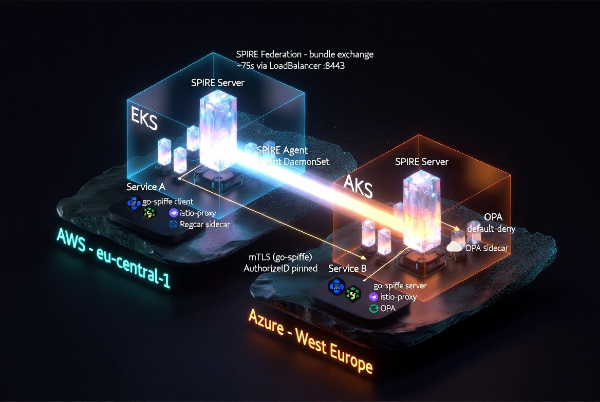

*Two independent Kubernetes clusters (EKS on AWS, AKS on Azure), each running its own SPIRE Server/Agent pair. The two trust domains federate over a dedicated LoadBalancer endpoint (bundle exchange, ~75s), so each side validates the other's workload certificates without a shared root CA.*

Both clusters run a full Istio control plane and SPIRE deployment, but the actual Service A to Service B call is **not** proxied by Envoy. That's a deliberate architecture decision, explained under "Why application-level mTLS" below.

<p align="right"><a href="#top">back to top ↑</a></p>

## Completion Criteria

All four completion criteria from the assignment are met, with direct evidence, before anything below this section:

1. **Service A (AWS) successfully calls the Azure service endpoint.** See [Proof: Successful Authenticated Call](#proof-successful-authenticated-call).
2. **Authentication is performed using workload identity and mTLS.** See [How Authentication Works](#how-authentication-works) and [Identities Issued](#identities-issued).
3. **No static credentials are stored anywhere.** No API keys, passwords, or long-lived tokens in either cluster. Identities are short-lived X.509-SVIDs fetched on demand via the SPIFFE Workload API. Confirmed at runtime, not just by design: zero `Secret` objects exist in either cluster's `workloads` namespace, and the only volumes mounted into Service A/B are the SPIFFE Workload API socket (ephemeral, SPIRE-rotated) and a ConfigMap holding the OPA policy text.
4. **If identity verification is disabled or the service lacks the correct identity, the request fails.** Two independent proofs: no client certificate at all is rejected during the TLS handshake (see [Proof](#proof-successful-authenticated-call)), and a valid-but-wrong identity is also rejected during the TLS handshake, before OPA or any application logic runs (see [Additional Negative Test: Identity Spoofing](#additional-negative-test-identity-spoofing)).

Everything from [Additional Negative Test: Identity Spoofing](#additional-negative-test-identity-spoofing) onward goes beyond what the assignment requires: extra verification and a security hardening pass done after the fact, on top of an already-complete deliverable.

<p align="right"><a href="#top">back to top ↑</a></p>

## Identities Issued

| Workload | Trust domain | SPIFFE ID | Issued via |
|---|---|---|---|
| Service A (AWS) | `aws.bridgethegap.local` | `spiffe://aws.bridgethegap.local/ns/workloads/sa/service-a` | k8s node attestation (`k8s_psat`) plus k8s workload attestor matching namespace/ServiceAccount/pod label |
| Service B (Azure) | `azure.bridgethegap.local` | `spiffe://azure.bridgethegap.local/ns/workloads/sa/service-b` | same mechanism, Azure SPIRE server |
| Istio sidecars (both clusters) | respective trust domain | `spiffe://<domain>/ns/<namespace>/sa/<service-account>` | `ClusterSPIFFEID` `istio-sidecar-reg`, matches pods labeled `spiffe.io/spire-managed-identity: "true"` |
| Istio ingress gateway (Azure) | `azure.bridgethegap.local` | `spiffe://azure.bridgethegap.local/ns/istio-system/sa/istio-ingressgateway` | `ClusterSPIFFEID` `istio-ingressgateway-reg` (not used in the Service A to B call path; part of the standard mesh install) |

All identities are X.509-SVIDs with short TTLs, rotated automatically by SPIRE. Nothing here is a static secret. No API key, password, or long-lived token is stored anywhere in either cluster or in the application code.

> [!NOTE]
> The SPIRE Helm chart also ships a built-in catch-all `ClusterSPIFFEID` (`spire-server-spire-default`), which by default would issue an identity to *any* pod in a non-system namespace. It has been explicitly disabled (`enabled = false`) since neither workload relies on it — see [Security Hardening & Trade-offs](#security-hardening--trade-offs).

**Proof from SPIRE itself** (registration entries: what SPIRE is actually configured to issue, not just what the application logs claim):

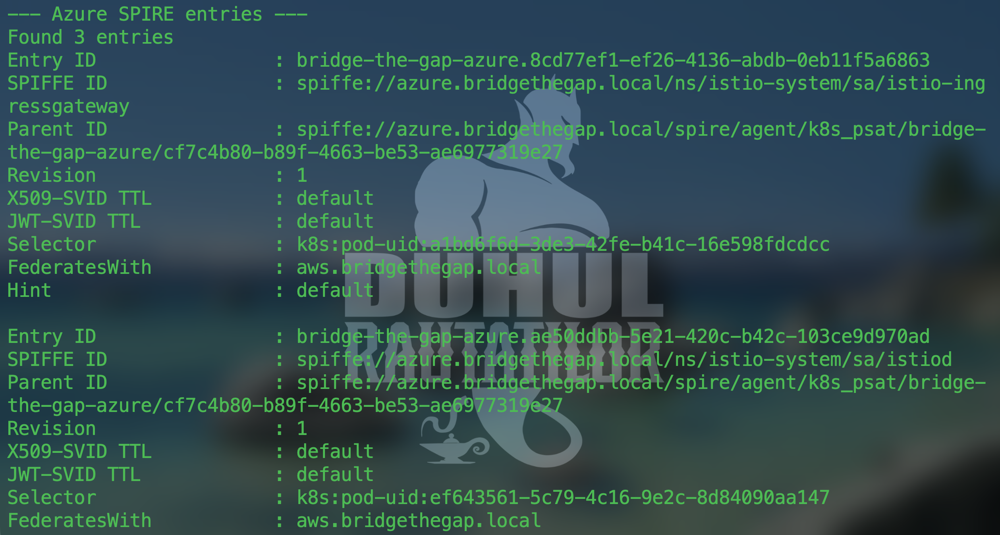

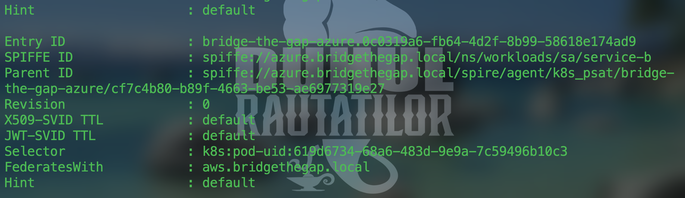

Both sides show `FederatesWith: <the other cloud's trust domain>` on every entry. That's SPIRE's own record of the federation relationship, not something asserted only in application code.

<details>
<summary><strong>Reproduce this proof yourself</strong> (click to expand)</summary>

```bash
# AWS
kubectl config use-context <your-aws-context>
kubectl exec -n spire-server spire-server-0 -c spire-server -- /opt/spire/bin/spire-server entry show

# Azure
kubectl config use-context <your-azure-context>
kubectl exec -n spire-server spire-server-0 -c spire-server -- /opt/spire/bin/spire-server entry show
```

</details>

<p align="right"><a href="#top">back to top ↑</a></p>

## Trust Relationship Between Environments

**Proof of automatic, periodic bundle refresh** (not a one-time static exchange; this is what makes the trust relationship dynamic rather than a shared secret):

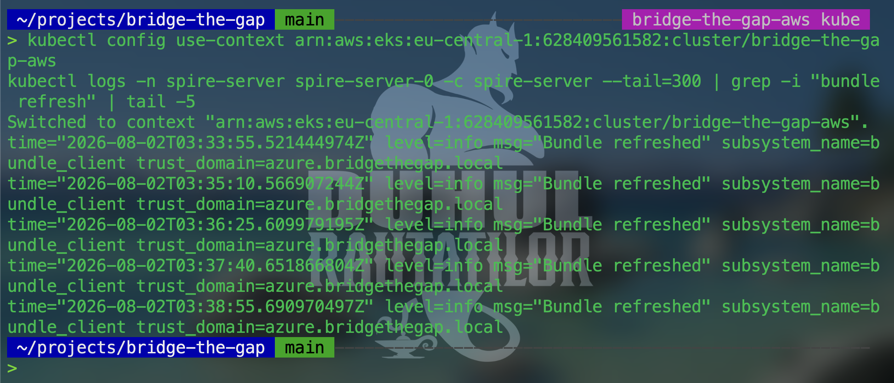

<details>
<summary><strong>Reproduce this proof yourself</strong> (click to expand)</summary>

```bash
kubectl config use-context <your-aws-context>
kubectl logs -n spire-server spire-server-0 -c spire-server --tail=300 | grep -i "bundle refresh" | tail -5
```

</details>

Each cloud runs its own independent SPIRE server with its own trust domain and root CA. The two clouds aren't naturally aware of each other. Trust between them is established through **SPIRE Federation**:

1. Each SPIRE server exposes a federation bundle endpoint (`spire-server-federation-lb`, a Kubernetes `LoadBalancer` Service), which serves that server's current trust bundle (its root CA certificates) over an mTLS-protected endpoint.
2. A `ClusterFederatedTrustDomain` resource on each side points at the other cloud's bundle endpoint.
3. Bootstrapping this relationship required one manual, trust-on-first-use exchange (`spire-server bundle set` / `bundle show`). That's the one moment a human had to vouch for the initial trust, standard practice for federation setup and similar to exchanging root certificates between two independent PKIs.
4. After bootstrap, each SPIRE server automatically re-fetches and refreshes the peer's bundle on its own (observed interval: about 75 seconds), so certificate rotation on either side never breaks trust. No manual re-exchange is ever needed again.

The practical effect: Service B's SPIRE server trusts AWS's root CA (and can therefore validate Service A's certificate), and Service A's SPIRE server trusts Azure's root CA, entirely through this dynamic bundle exchange, never through a shared static secret.

<p align="right"><a href="#top">back to top ↑</a></p>

## How Authentication Works

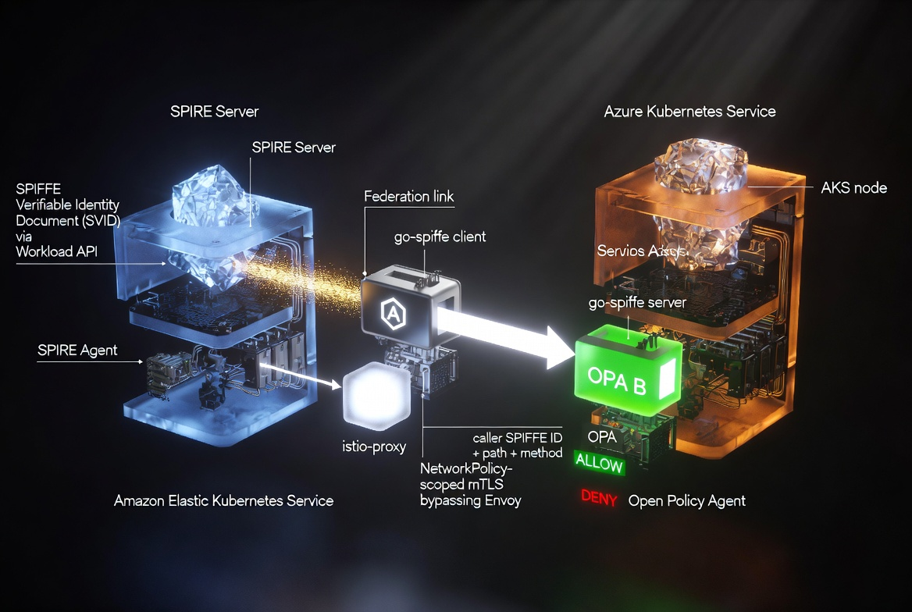

*Service A's go-spiffe client fetches its SVID from the local SPIRE Agent over the Workload API and pins Service B's exact SPIFFE ID via `AuthorizeID` before the mTLS handshake. On Service B, the caller's SPIFFE ID plus the requested path/method are handed to an OPA sidecar, which returns allow/deny before the request reaches the application handler.*

**1. Node attestation.** Every SPIRE agent proves to its SPIRE server that it's running on a legitimate node in the cluster, using the `k8s_psat` (Kubernetes Projected Service Account Token) attestor. The node presents a token bound to the Kubernetes API server, which SPIRE validates against the cluster's own token review API. This ties node identity to something Kubernetes itself vouches for, not to network location (IP/hostname), which is spoofable and ephemeral in cloud environments.

**2. Workload attestation.** Once an agent is trusted, it attests the workloads running on it using the k8s workload attestor. For every pod requesting an identity, SPIRE inspects the pod's actual namespace, ServiceAccount, and labels (via the container runtime / kubelet) and matches them against the selectors declared in a `ClusterSPIFFEID` resource. Only pods matching `spiffe.io/spire-managed-identity: "true"` in the `workloads` namespace, with the expected ServiceAccount, receive an SVID for `service-a` or `service-b`. A pod can't claim an identity it doesn't structurally match. There's no shared secret a compromised pod could steal and reuse elsewhere.

**3. SVID issuance.** SPIRE issues each workload a short-lived X.509-SVID over the SPIFFE Workload API (a Unix domain socket, `csi.spiffe.io`, mounted read-only into the pod). The workload never sees or handles a static key it could leak. It fetches short-lived key material on demand and SPIRE rotates it automatically.

**4. Mutual TLS at the application layer.** Both Service A and Service B use `go-spiffe/v2` directly. Service A opens an mTLS client via `tlsconfig.MTLSClientConfig`, Service B serves via `tlsconfig.MTLSServerConfig`. Each side requires the peer's certificate to resolve to one exact expected SPIFFE ID (`tlsconfig.AuthorizeID`), not merely "any SPIFFE identity" (`AuthorizeAny`, which would be a serious authorization gap). Both directions are mutually authenticated: Service B only accepts connections from `spiffe://aws.bridgethegap.local/ns/workloads/sa/service-a`, and Service A only trusts a server presenting `spiffe://azure.bridgethegap.local/ns/workloads/sa/service-b`.

**5. Authorization (OPA).** Passing the mTLS handshake only proves identity. It doesn't decide what a caller may do. Service B extracts the caller's verified SPIFFE ID from the TLS peer certificate and asks an OPA sidecar (bound to `localhost:8181`, unreachable outside the pod) to evaluate a Rego policy against `{spiffe_id, path, method}`. The policy is a default-deny allow-list: only `GET /hello` from `service-a`'s exact identity is permitted, `/admin` is denied regardless of caller. The application fails closed if OPA is unreachable.

### Why application-level mTLS, not an Istio-native mesh hop

The initial plan was to let Envoy terminate mTLS for this call, using Istio's SPIFFE integration end-to-end. In practice, Istio's SDS-based certificate distribution (via istio-agent) only requests and serves its own fixed trust bundle vocabulary (`default`/`ROOTCA`) and doesn't automatically merge an additional SPIFFE-federated trust domain's CA into Envoy's validation context. That's a genuine integration gap between vanilla Istio sidecar injection and SPIFFE Federation, not a misconfiguration on our side (verified on Istio **1.30.3**; the [official Istio SPIRE integration docs](https://istio.io/v1.30/docs/ops/integrations/spire/) cover only single-cluster scenarios with no cross-trust-domain federation support). Root-caused empirically via `remote error: tls: unknown certificate` — see **Challenges Encountered** below for the full debugging trace. Fixing it properly would require a custom `EnvoyFilter` with a statically pre-combined CA bundle, which is real production engineering but goes beyond this project's stated scope ("mutual TLS authentication between services", not "Envoy must terminate every hop"). We deliberately descoped that path and instead terminate SPIFFE mTLS natively in the application via `go-spiffe`, which satisfies every stated completion criterion without the added complexity. Istio and its sidecars remain fully deployed and functioning for identity issuance to the mesh's own components. They just aren't the enforcement point for this specific cross-cloud hop.

<p align="right"><a href="#top">back to top ↑</a></p>

## Proof: Successful Authenticated Call

**The real certificate served by Service B**, extracted directly from the network, not from application code or logs. Note the SPIFFE URI in the Subject Alternative Name and a short validity window (currently configured via `defaultX509SvidTTL = "30m"` in `spire.tf`, reduced from an earlier `2h` value), not months or years:

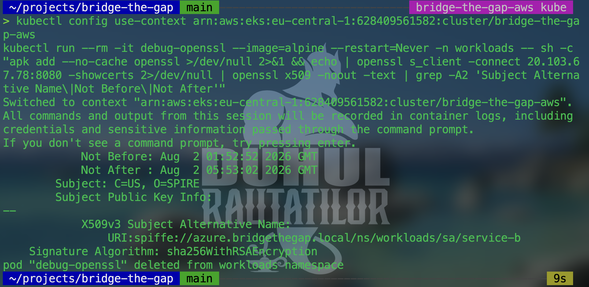

<details>
<summary><strong>Reproduce this proof yourself</strong> (click to expand)</summary>

```bash
echo | openssl s_client -connect <service-b-external-ip>:8080 -showcerts 2>/dev/null \
  | openssl x509 -noout -text \
  | grep -A2 "Subject Alternative Name\|Not Before\|Not After"
```

</details>

Both services also log their own verified SPIFFE identity on startup:

```
Service A identity: spiffe://aws.bridgethegap.local/ns/workloads/sa/service-a
Service B identity: spiffe://azure.bridgethegap.local/ns/workloads/sa/service-b
```

Calling through Service A's test endpoint (which triggers the outbound mTLS call to Service B): `/hello` succeeds, and the restricted `/admin` path is denied by the OPA policy for the same authenticated identity.

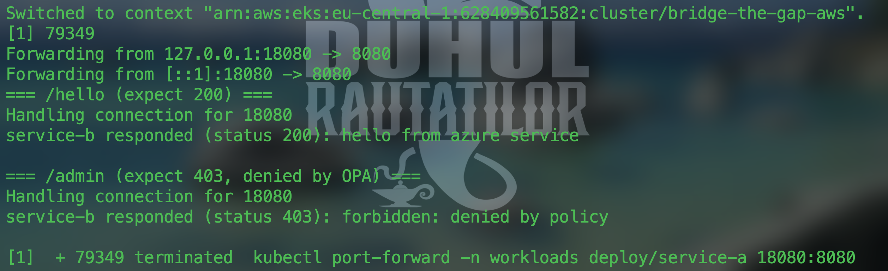

OPA's decision log for those same two requests, showing the actual input evaluated (caller identity, path, method) and the resulting decision:

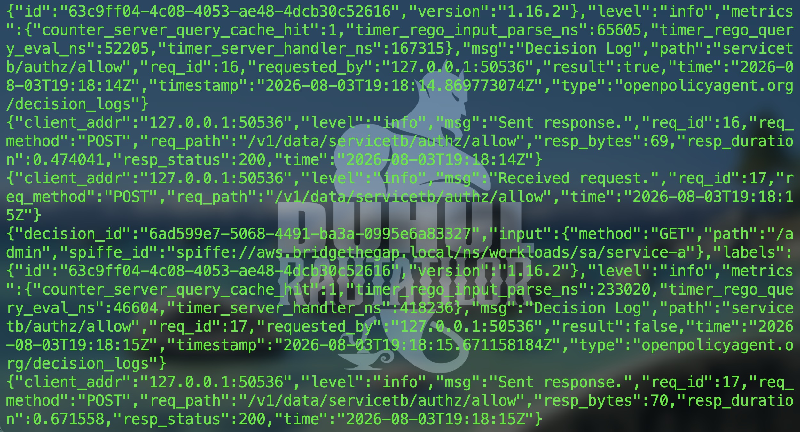

<details>
<summary><strong>Reproduce this proof yourself</strong> (click to expand)</summary>

```bash
kubectl port-forward -n workloads deploy/service-a 18080:8080 &
curl -s http://localhost:18080/call-service-b
curl -s http://localhost:18080/call-service-b-admin

kubectl config use-context <your-azure-context>
kubectl logs -n workloads -l app=service-b -c opa --tail=10
```

</details>

**Negative test (completion criterion #4):** a client presenting no certificate at all is rejected during the TLS handshake itself, before any HTTP request is even processed. Re-verified live: `curl` consistently fails with `Recv failure: Connection reset by peer`, reproduced identically over both the external LoadBalancer IP and the internal ClusterIP, and independent of TLS version (1.2 forced vs 1.3 default) - ruling out the network path or protocol negotiation as the cause. The rejection is enforced by the application's own mTLS server (`tlsconfig.MTLSServerConfig`, `ClientAuth: RequireAndVerifyClientCert`), not by the network layer. Identity isn't optional here. The connection can't be established at all without it, let alone reach the authorization layer.

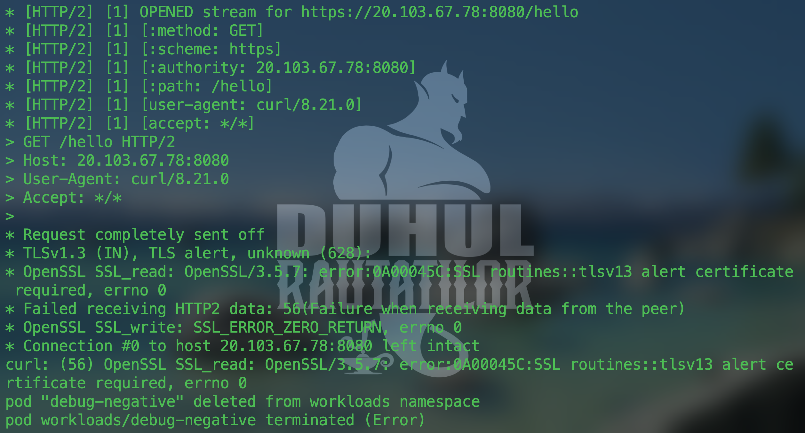

<details>
<summary><strong>Reproduce this proof yourself</strong> (click to expand)</summary>

```bash
curl -v -k https://\<service-b-external-ip\>:8080/hello
```

</details>

<p align="right"><a href="#top">back to top ↑</a></p>

## Additional Negative Test: Identity Spoofing

> [!NOTE]
> This test goes beyond the "no client certificate" case already documented above. It proves that mTLS enforcement is based on cryptographic identity (SPIFFE ID bound to a SPIRE-issued SVID), not just "is TLS present."

**Setup**: a workload running under a *different* Kubernetes ServiceAccount in the same `workloads` namespace (so it still receives a valid SPIRE-issued SVID, just with a different SPIFFE ID than `spiffe://aws.bridgethegap.local/ns/workloads/sa/service-a`) attempts to call Service B directly.

**Expected result**: Service B's `tlsconfig.AuthorizeID(clientID)` pins the TLS handshake to the exact expected SPIFFE ID. A different, valid, SPIRE-issued identity is still rejected — proving the check is identity-based, not merely "any valid SPIRE cert accepted."

<details>
<summary>Reproduce this test</summary>

A throwaway `imposter-sa` ServiceAccount and a pod using the exact same image, port, environment variables, and SPIFFE Workload API CSI volume as `service-a` were deployed into the `workloads` namespace on the AWS cluster.

```bash
kubectl apply -f imposter-pod.yaml
kubectl wait --for=condition=Ready pod/imposter -n workloads --timeout=60s
```

Confirmed the pod received a real, valid, but different SPIRE-issued identity (own service account, not `service-a`'s):

```
Service A identity: spiffe://aws.bridgethegap.local/ns/workloads/sa/imposter-sa
```

Triggered the call from inside the pod's own sidecar, the same reproduction path used for every other verification in this document:

```bash
kubectl exec -n workloads pod/imposter -c istio-proxy -- curl -s http://localhost:8080/call-service-b
```

Actual result:

```
call to service-b failed: Get "https://<service-b-ip>:8080/hello": read tcp <imposter-ip>:<port>-><service-b-ip>:8080: read: connection reset by peer
```

Service B tore down the connection during the TLS handshake itself, before the HTTP request was ever processed by the application or OPA. Note: Service B's own log at this exact moment is mixed with unrelated load-balancer health-check probes, which produce generic TLS `EOF` entries indistinguishable from this specific rejection - so the imposter's own error is the reliable evidence here, not a server-side log line. This confirms `tlsconfig.AuthorizeID` enforces the exact expected SPIFFE ID, not merely "any valid SPIRE-issued certificate": a real, SPIRE-issued identity with the wrong ServiceAccount is still rejected.

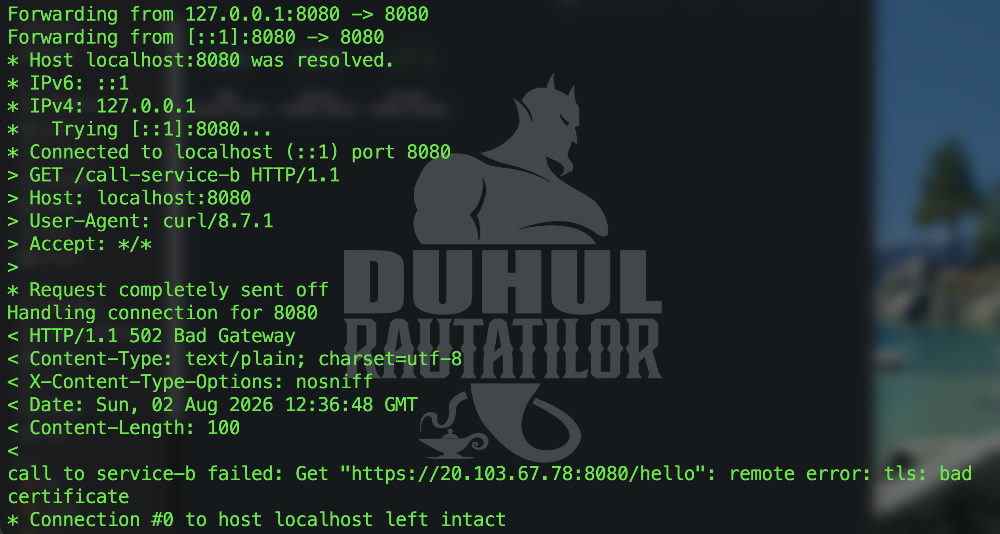

</details>

<p align="right"><a href="#top">back to top ↑</a></p>

## Bonus Challenge 1: Workload Attestation

Already covered in detail under "How Authentication Works", steps 1 and 2. In summary: **node attestation** uses `k8s_psat`, and **workload attestation** uses the k8s workload attestor matching namespace, ServiceAccount, and pod labels, driven declaratively by `ClusterSPIFFEID` resources (managed in Terraform, see `terraform/aws/spire.tf` and `terraform/azure/spire.tf`).

This mechanism was chosen over cloud-metadata-based attestation (like AWS/Azure instance identity documents) because it's Kubernetes-native and portable across both clouds with the same logic. The same attestation model applies whether the cluster runs on AWS or Azure, which matters directly for a cross-cloud project. It also ties identity to attributes Kubernetes RBAC already governs (namespace, ServiceAccount), rather than to network-layer facts (IP, hostname) that are ephemeral and, in a compromised-node scenario, potentially attacker-influenced.

<p align="right"><a href="#top">back to top ↑</a></p>

## Bonus Challenge 2: Authorization Policy

Implemented and verified (see "Proof" above). `/hello` is allowed for `service-a`'s exact SPIFFE identity, `/admin` is denied unconditionally. Enforcement is via an **OPA sidecar** (Policy Decision Point) plus a Go middleware in Service B (Policy Enforcement Point), rather than an Istio `AuthorizationPolicy`. That's a direct consequence of the architecture decision above: Envoy doesn't terminate this port's mTLS, so it can't see the HTTP path to apply an `AuthorizationPolicy` against. That enforcement point would be a structural no-op given how this hop is secured. OPA was chosen specifically because the assignment names it as a valid alternative mechanism to Istio-native authorization.

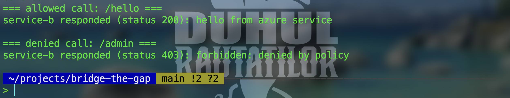

<p align="right"><a href="#top">back to top ↑</a></p>

## Bonus Challenge 3: Observability

**Implemented, with an empirically confirmed limitation documented rather than hidden.** Kiali visualizes mesh traffic by observing what Envoy proxies. Because the authenticated Service A to Service B call deliberately bypasses Envoy interception (`traffic.sidecar.istio.io/excludeInboundPorts`) so the application can terminate SPIFFE mTLS natively, the reasoning below (written before installing anything) predicted Kiali wouldn't show this specific hop. This was then verified empirically: Prometheus (`kube-prometheus-stack`) and Kiali (`kiali-server`) were installed via Terraform (`terraform/azure/observability.tf`), wired together, and `istio_requests_total` was queried directly against Prometheus right after triggering real, authenticated calls - it returns zero samples for this traffic, confirming the prediction rather than contradicting it.

What Kiali and Prometheus *do* show, correctly:

- All Envoy/istiod scrape targets healthy (`istio-mesh` job, 4/4 up): 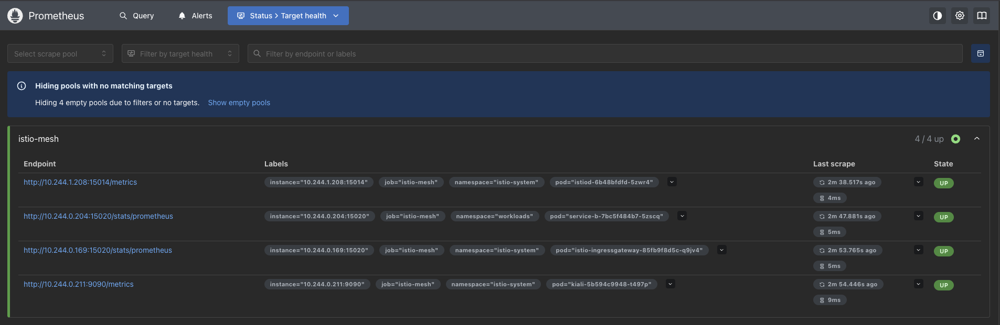
- The mesh's own control-plane topology (istiod, ingress gateway, Kiali): 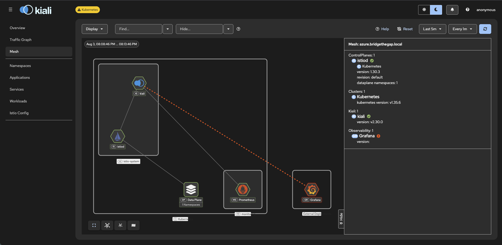
- `STRICT` mTLS enforced on both `istio-system` and `workloads` namespaces - the separate, automatic Istio-managed mTLS layer (see [Why application-level mTLS, not an Istio-native mesh hop](#why-application-level-mtls-not-an-istio-native-mesh-hop)): 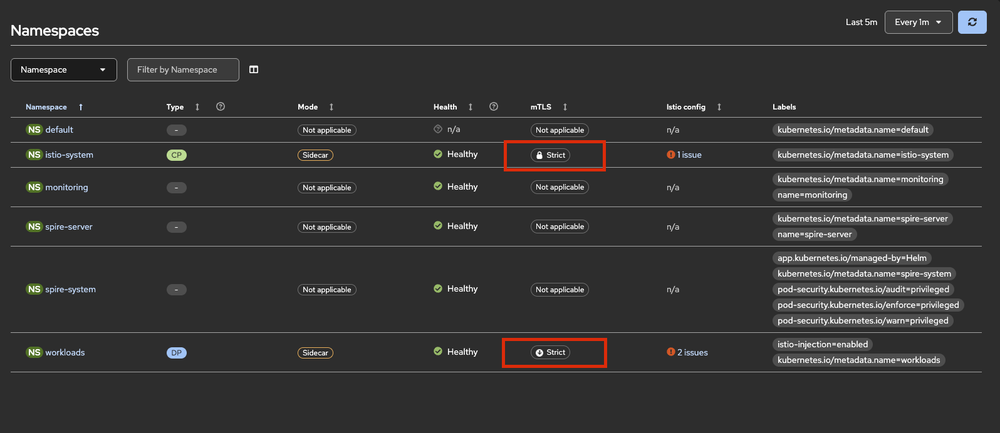

A real, unrelated gap was found and fixed along the way: the pre-existing `service-b-default-deny` NetworkPolicy (deny-by-default, item 4 below) blocked Prometheus from ever reaching the sidecar's stats endpoint, and that NetworkPolicy itself had never been brought under Terraform. Both were fixed in the same pass (`terraform/azure/network-policy.tf`, imported into state, one added ingress rule scoped to the `monitoring` namespace on port 15020).

The infrastructure was kept rather than reverted: it is genuinely useful (mesh health, the separate Istio-native mTLS layer), fully under Terraform, and zero ongoing risk - it is just not a substitute for the application-level SPIFFE proof, which remains the [curl-based verification](#proof-successful-authenticated-call) and [identity spoofing test](#additional-negative-test-identity-spoofing) above.

<p align="right"><a href="#top">back to top ↑</a></p>

## Challenges Encountered

- **SPIRE Federation bootstrap** required understanding the distinction between the one-time manual trust-on-first-use bundle exchange and the ongoing automatic refresh. Easy to conflate the two at first.
- **Infrastructure drift into raw `kubectl`**: the `ClusterSPIFFEID` registrations were initially applied by hand outside Terraform. Caught and brought under IaC (`terraform import` on Azure, fresh resources on AWS) so the whole platform layer stays declarative. Application workloads (Service A/B deployments, the OPA ConfigMap) stay on `kubectl` deliberately, not by oversight: infra changes rarely and belongs in Terraform, workloads change on every image bump and belong in CI/CD instead.
- **Cross-trust-domain mTLS validation gap in Istio/SPIFFE Federation**: extensively debugged (`remote error: tls: unknown certificate`), root-caused to Istio's SDS proxy not merging federated CA bundles into Envoy's validation context. Explored a full `EnvoyFilter` plus static combined-bundle fix, then deliberately stepped back from it as over-engineering relative to the actual assignment scope, landing on application-level SPIFFE mTLS instead.
- **Docker image architecture mismatch**: Docker Desktop on Apple Silicon builds `arm64` images by default, but both EKS and AKS nodes run `amd64`, causing `ErrImagePull: no match for platform in manifest`. Fixed by building explicitly with `--platform linux/amd64`.
- **Terraform drift on Azure**: an externally-injected `created-on` tag (very likely a subscription-level Azure Policy) and an undeclared `default_node_pool.upgrade_settings` block both caused `terraform plan` to show phantom changes on every run. Fixed with a scoped `lifecycle { ignore_changes }` for the tag and by declaring the block's actual default values.
- **Azure Load Balancer health probes** initially looked like suspicious repeated TLS handshake failures in Service B's logs. Confirmed via node/pod IP correlation that they were the LB's own bare-TCP health check hitting a TLS-only port. Benign, not a security signal.
- **AWS credential expiry mid-`terraform apply`**: a browser-based IAM login session (`aws login --profile <profile>`) expired while Terraform was polling an in-flight EKS cluster update, surfacing as `ExpiredTokenException` on the `DescribeUpdate` call. The underlying AWS-side update had already succeeded; only the local polling session had gone stale. Verified directly against AWS (`aws eks describe-update`) before re-running Terraform, to avoid double-submitting a conflicting update against a resource still mid-change.

<p align="right"><a href="#top">back to top ↑</a></p>

## Security Hardening & Trade-offs

After the core requirements above were met, a follow-up pass audited the platform for additional weak points. Each item below was independently verified — reproduced live, not assumed — before being marked resolved or accepted.

| # | Item | Status |
|---|---|---|
| 1 | Pod `securityContext` hardening | ✅ Applied |
| 2 | Pod Security Admission `restricted` | ⛔ Evaluated, not applied |
| 3 | SPIRE agent kubelet certificate verification | ⛔ Attempted, reverted |
| 4 | NetworkPolicy deny-by-default | ✅ Applied |
| 5 | Kubernetes API server public access | ✅ Restricted |
| 6 | SPIRE fallback catch-all identity | ✅ Disabled |
| 7 | Istio mesh-level vs. application-level mTLS | 🔵 Architectural, accepted |
| 8 | Hardcoded egress IP in `NetworkPolicy` | 🔵 Accepted trade-off |
| 9 | Local `terraform.tfstate` stored unencrypted | 🔵 Accepted trade-off |
| 10 | `ClusterSPIFFEID` missing `className`/`federatesWith` (masked until cluster restart) | ✅ Fixed |
| 11 | Go dependencies pinned via `go.mod`/`go.sum` | ✅ Applied |
| 12 | `automountServiceAccountToken` disabled on service-a/service-b | ✅ Applied |
| 13 | `PeerAuthentication` STRICT parity across both clouds | ✅ Applied |

### 1. Pod `securityContext` hardening

> [!TIP]
> **Applied.** `service-a`, `service-b`, and their containers were updated with `readOnlyRootFilesystem: true`, `allowPrivilegeEscalation: false`, `runAsNonRoot: true`, `runAsUser: 65532` (the numeric UID of the distroless `nonroot` user), `seccompProfile.type: RuntimeDefault`, and `capabilities.drop: [ALL]`. Verified live on both clusters (`kubectl get pod -o jsonpath` showing the applied `securityContext`) and functionally (a real authenticated call to `/call-service-b` still returns `200` after the change).

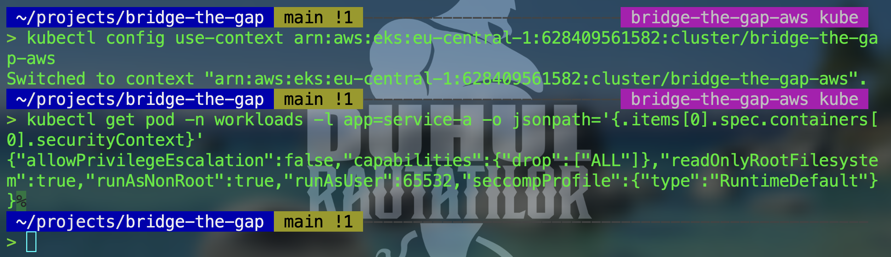
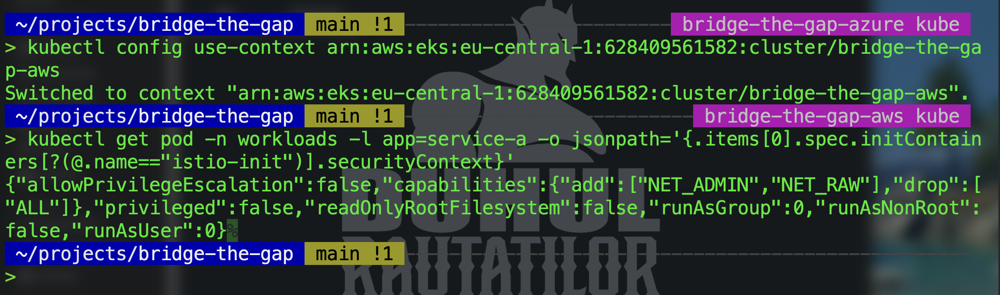
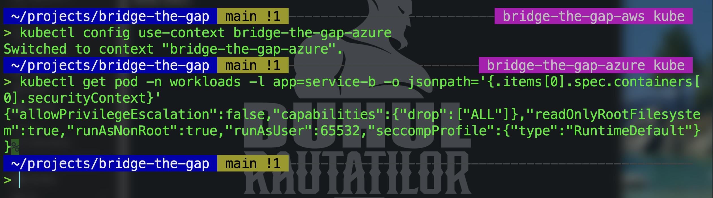

### 2. Pod Security Admission `restricted` label

> [!IMPORTANT]
> **Evaluated, not applied — by design.** Enabling the `restricted` Pod Security Standard on the `workloads` namespace was tested against the live `istio-init` container injected by classic (non-CNI) sidecar injection. That container runs as root and requires `NET_ADMIN`/`NET_RAW` capabilities to install the iptables redirect rules — both of which `restricted` disallows. Applying this label would have broken every future pod rollout in the namespace. This is a documented, deliberate trade-off, not an oversight: the assignment explicitly asked to avoid changes that affect stable operation.
>
> **Update:** also tested the `baseline` profile (the permissive middle tier between no PSA and `restricted`) directly against the live namespace, in case it offered a usable floor. It fails for the identical reason: `baseline` also disallows adding capabilities beyond a container's default set, and `istio-init` still needs `NET_ADMIN`/`NET_RAW`. Confirmed live: labeling the namespace `pod-security.kubernetes.io/enforce=baseline` and forcing a rollout produced `FailedCreate` events quoting exactly that capability violation; the label was removed immediately and the rollout completed normally afterward, with zero lasting impact (PSA only gates admission of *new* pods, not already-running ones). This confirms the incompatibility is with classic `istio-init`-based sidecar injection itself, at any PSA enforcement level, not specifically with `restricted`'s stricter rules. The real fix would be switching to Istio's CNI-based sidecar injection plugin, which removes the need for a privileged init container entirely; that's a valid direction for future work, not something done here.

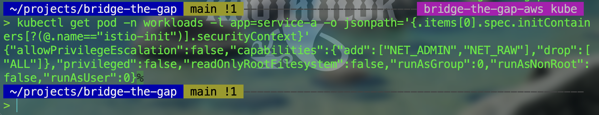

### 3. SPIRE agent kubelet certificate verification

> [!IMPORTANT]
> **Attempted live, reverted after a contained failure.** The current setting (`workloadAttestors.k8s.verification.type: skip`) does not verify the kubelet's serving certificate when the agent attests workloads — a real, if narrow, local-trust gap. Switching to `auto` was tested live on one AWS node; the `gather-host-cert` init container failed because that node's kubelet serving certificate has no `localhost` SAN, blocking `spire-agent` from starting. The failure was contained to a single node (of two), diagnosed with `helm history` / `helm get values` / `helm template`, and fully reverted via `kubectl replace` plus a clean `terraform apply`. Both agents confirmed `1/1 Running` and a real authenticated call confirmed still working before closing this out. Left at `skip` deliberately, to avoid the instability this introduces on the current kubelet certificate setup.

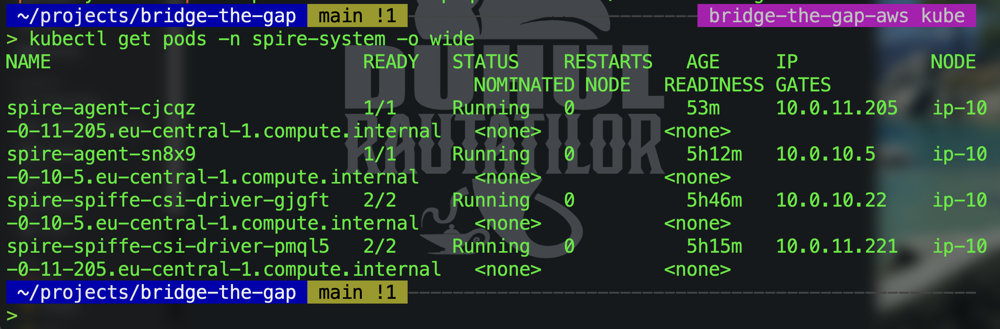

### 4. NetworkPolicy deny-by-default

> [!TIP]
> **Applied — after finding enforcement wasn't actually active.** Verification came first: network policy enforcement was not active on either cluster despite the underlying CNI plugins/CRDs being present. On AWS, a test `NetworkPolicy` produced zero `PolicyEndpoint` objects from the VPC CNI's network policy agent, proving policies were silently ignored (`ENABLE_NETWORK_POLICY` was unset by default). On Azure, `networkPolicy: "none"` on the AKS network profile confirmed no policy engine was installed at all. Fixed both: brought `vpc-cni` under Terraform as a managed EKS addon with `enableNetworkPolicy: true` (see `terraform/aws/eks.tf`), and enabled Azure Network Policy Manager on AKS via `az aks update --network-policy azure` (a real node pool reimage, accepted deliberately as a contained operation). Applied a default-deny `NetworkPolicy` to `service-a` and `service-b`, with explicit allows only for DNS, istiod, and the cross-cloud call itself (`k8s/service-a/networkpolicy.yaml`, `k8s/service-b/networkpolicy.yaml`). Verified twice: the real authenticated call still returns `200` after enforcement went live, and a throwaway pod inside the Azure cluster that could previously reach `service-b`'s internal ClusterIP directly now times out.

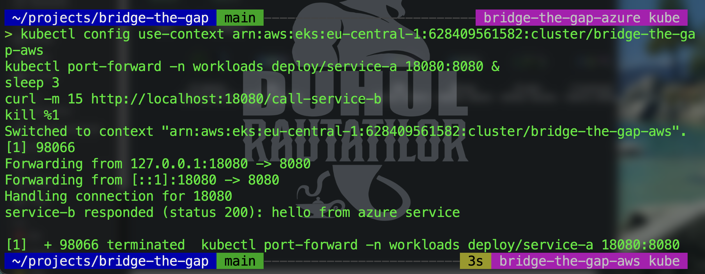
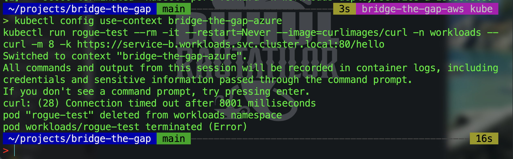

> **Update:** while wiring up Prometheus (bonus #3), found that this exact `NetworkPolicy` (`service-b-default-deny`) had itself never been brought under Terraform - it existed only as a live, `kubectl apply`-managed object, invisible to `terraform plan`. Imported it into state (`terraform import kubernetes_network_policy_v1.service_b_default_deny workloads/service-b-default-deny`) and added the missing ingress rule for Prometheus to scrape the sidecar's stats endpoint on port 15020 from the `monitoring` namespace, entirely in `terraform/azure/network-policy.tf`. `terraform plan` now shows zero drift on this resource going forward.

### 5. Kubernetes API server public access

> [!TIP]
> **Restricted, without touching node-to-control-plane connectivity.** Both Kubernetes API servers were reachable from any IP on the internet (`endpoint_public_access = true` on EKS with no CIDR restriction, no `authorized_ip_ranges` on AKS), authenticated only by IAM/AAD, with no network-layer allowlist. Fixed on both: AWS EKS now runs with `endpoint_private_access = true` (node-to-control-plane traffic automatically uses the private VPC path per AWS's own documented behavior, no VPN/bastion needed since nodes already live in the VPC) plus `public_access_cidrs` restricted to a single admin IP; Azure AKS now has an `api_server_access_profile.authorized_ip_ranges` restricting the public endpoint to the same admin IP (AKS automatically also allows the Standard Load Balancer's own outbound IP, so the node pool cannot lock itself out of its own control plane). Verified on both clusters: `aws eks describe-cluster` / `az aks show` confirm the restriction is live, both node pools stayed `Ready` throughout, and the real cross-cloud authenticated call (`/call-service-b`) still returns `200` after the change.

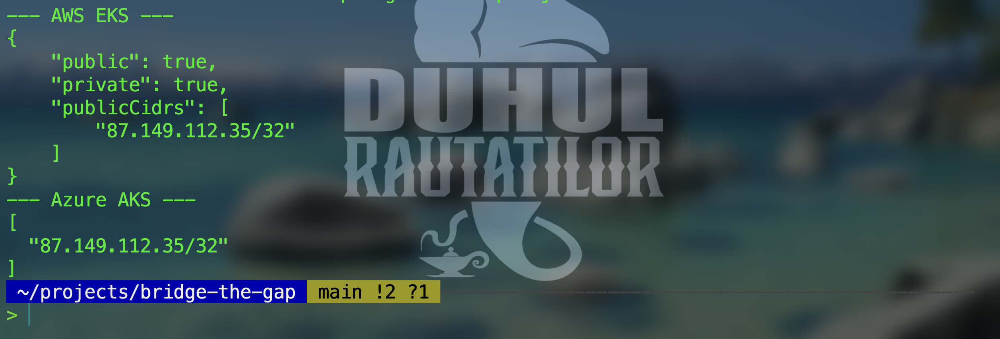
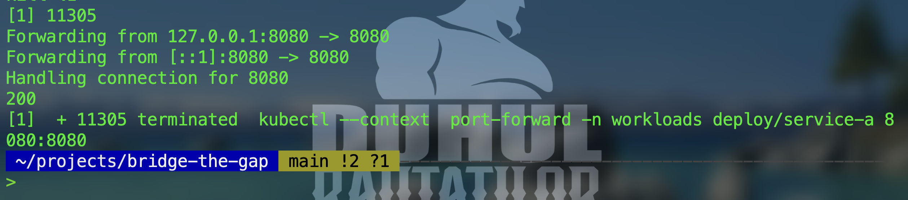

### 6. SPIRE fallback catch-all identity

> [!TIP]
> **Disabled — the unused chart default, not the identities actually in use.** The SPIRE Helm chart ships a built-in `default` `ClusterSPIFFEID` (`spire-server-spire-default`) with `podSelector: {}` and `fallback: true`, meaning it would issue a SPIFFE ID to *any* pod scheduled into a non-system namespace, not just `service-a`/`service-b`. Confirmed neither workload actually depends on it: both get their real identity from the dedicated `istio-sidecar-reg` `ClusterSPIFFEID` (scoped to pods labeled `spiffe.io/spire-managed-identity: "true"`), and Azure's ingress gateway from `istio-ingressgateway-reg` (scoped by namespace/ServiceAccount selector templates). Set `controllerManager.identities.clusterSPIFFEIDs.default.enabled = false` in both `terraform/aws/spire.tf` and `terraform/azure/spire.tf`. Verified on both clusters: `kubectl get clusterspiffeid` no longer lists `spire-server-spire-default`, and the real cross-cloud authenticated call still returns `200`.
>
> **Postscript, added after a later incident:** this check was true at the time, but didn't survive a later infrastructure event unrelated to this change. See [item 10](#10-clusterspiffeid-missing-classnamefederateswith-masked-until-cluster-restart) for what actually broke and why.

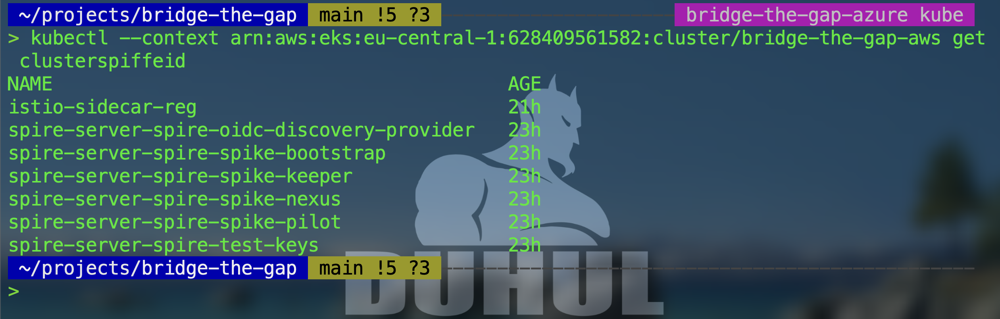

### 7. Istio mesh-level vs. application-level mTLS

> [!NOTE]
> **Architectural, not a gap.** Istio mTLS is enforced at the sidecar/mesh level for in-mesh traffic, while the cross-cloud federated call between AWS and Azure relies on application-level mTLS via `go-spiffe`, because Istio's SDS does not natively consume SPIRE's federated bundles across two independent control planes. Covered in full detail under [Why application-level mTLS](#why-application-level-mtls-not-an-istio-native-mesh-hop); noted here again for completeness alongside the other trade-offs.

### 8. Hardcoded egress IP in `NetworkPolicy`

> [!NOTE]
> **Accepted trade-off, not easily fixable without an architecture change.** The `service-a` egress `NetworkPolicy` hardcodes Service B's external LoadBalancer IP as an `ipBlock`, the same fragility as the AWS NAT Gateway's Elastic IP referenced manually in Azure's `load_balancer_source_ranges`. If the LoadBalancer Service is ever recreated and gets a new external IP, the egress rule and the `SERVICE_B_BASE_URL` environment variable both need a manual update, or the policy silently blocks the now-legitimate traffic — fail-closed, not a security hole, but an operational fragility. A clean fix (referencing the destination by name/label instead of IP) would require switching the AWS CNI's network policy engine to Cilium, a real architecture change outside this PoC's scope.

### 9. Local `terraform.tfstate` stored unencrypted

> [!NOTE]
> **Accepted trade-off, a scope decision rather than an oversight.** Neither cloud has a remote Terraform backend configured, so `terraform.tfstate` is written locally, unencrypted, and contains AKS admin credentials in plaintext. The file is git-ignored and never leaves the local machine (verified: `git log --all --full-history` shows no `.tfstate` file was ever committed), but anyone with read access to the machine itself could extract cluster admin credentials from it. The correct production fix is a remote, encrypted backend (S3+KMS, Azure Storage with encryption at rest); standing that up was deliberately descoped here as disproportionate infrastructure change for a stated small proof-of-concept.

<p align="right"><a href="#top">back to top ↑</a></p>

### 10. `ClusterSPIFFEID` missing `className`/`federatesWith` (masked until cluster restart)

> [!TIP]
> **Found via a real incident, not a scheduled review — fixed.** After a routine AKS stop/start, `service-b` came back `3/3 Ready` but never bound port 8080. Root cause: `spire-controller-manager` was silently ignoring both `ClusterSPIFFEID` resources we define (`istio-sidecar-reg`, `istio-ingressgateway-reg`) because neither set `.spec.className`, and the controller is configured to skip any CR without one (`handleCRsWithoutClassName: false`) — no error, no log, `spire-server entry show` simply returned zero entries. Fixing that surfaced a second, more serious gap: only the now-disabled fallback catch-all (item 6) had ever had `federatesWith` configured. The real, in-use entries never did. Once `className` was fixed and entries flowed again, `service-a`'s certificate was rejected by `service-b` with `remote error: tls: bad certificate` — the actual cause, from `service-b`'s own logs, was `no X.509 bundle for trust domain "aws.bridgethegap.local"`. In other words, the cross-cloud call had been running on a masked failure mode since the fallback was disabled: it kept working only because SPIRE never needed to re-reconcile the affected entries until this restart forced it to. Fixed by adding `className = "spire-server-spire"` and `federatesWith` (each side listing the other's trust domain) directly to `istio_sidecar_reg` in both `terraform/aws/spire.tf` and `terraform/azure/spire.tf`. Verified: `spire-server entry show` lists live entries with `FederatesWith` populated on both clusters, the real authenticated call returns `200` again, the negative test (no client certificate) is still rejected with `certificate required`, and the `/admin` `AuthorizationPolicy` deny path still returns `403` in OPA's decision log.

### 11. Go dependencies pinned via `go.mod`/`go.sum`

> [!TIP]
> **Applied.** Both `service-a` and `service-b`'s `Dockerfile`s ran `go mod init` + `go get github.com/spiffe/go-spiffe/v2@latest` + `go mod tidy` inside the build itself, with no `go.mod`/`go.sum` committed to the repository — meaning every image build could silently resolve a different dependency version, including transitive ones, with zero diff in git to show it happened. Fixed: generated `go.mod`/`go.sum` for both services (pinning `go-spiffe/v2 v2.8.1` and its full transitive dependency graph via `go.sum` hashes), committed both files, and changed the `Dockerfile`s to `COPY go.mod go.sum ./` followed by `go mod download` instead of resolving `@latest` at build time. Verified: both images rebuild cleanly (`docker build --no-cache`) with the pinned dependency set.

<p align="right"><a href="#top">back to top ↑</a></p>

### 12. `automountServiceAccountToken` disabled on service-a/service-b

> [!TIP]
> **Applied.** Kubernetes mounts a ServiceAccount JWT token into every pod by default (`automountServiceAccountToken`, unset means `true`), even when the pod never calls the Kubernetes API. Neither `service-a` nor `service-b` needs this: both only speak SPIFFE mTLS to each other and to OPA, never to the Kubernetes API server. An unused token mounted into the pod is unnecessary attack surface if the container is ever compromised - a stolen token could be replayed against the Kubernetes API. Set `automountServiceAccountToken: false` on both pod specs (`k8s/service-a/deployment.yaml`, `k8s/service-b/deployment.yaml`). Verified on both clusters: `kubectl get pod -o jsonpath='{.spec.automountServiceAccountToken}'` returns `false` on both, and the real cross-cloud authenticated call still returns `200` after the rollout.

<p align="right"><a href="#top">back to top ↑</a></p>

### 13. `PeerAuthentication` STRICT parity across both clouds

> [!TIP]
> **Applied.** Auditing Istio's own mesh-level mTLS enforcement (distinct from the application-level SPIFFE mTLS covered above) found two separate gaps. First, the AWS cluster had zero `PeerAuthentication` resources at all - with none defined, Istio defaults to `PERMISSIVE` mode, meaning every sidecar in the mesh would accept both mTLS and plaintext connections. Azure, by contrast, already enforced `STRICT` mesh-wide - but that resource had been applied directly via `kubectl` at some point and was never captured in Terraform, the same "apply but never commit" pattern found elsewhere in this project (see the update under item 4). A rebuild from this repository alone would have silently reproduced Azure's mesh in `PERMISSIVE` mode without anyone noticing. Fixed both: added an explicit `PeerAuthentication` (`istio-system/default`, `mtls.mode: STRICT`) as a `kubernetes_manifest` resource on AWS (`terraform/aws/istio-mtls.tf`), and imported Azure's existing live resource into Terraform state under the same file pattern (`terraform/azure/istio-mtls.tf`). Verified on both clusters: `kubectl get peerauthentication -n istio-system default` returns `STRICT` on both, `terraform plan` shows zero drift, and the real cross-cloud authenticated call still returns `200` after both changes.

<p align="right"><a href="#top">back to top ↑</a></p>

## Infrastructure Teardown

Not yet performed. Infrastructure is still up for demonstration purposes. To tear down:

```bash
cd terraform/azure && terraform destroy
cd terraform/aws && terraform destroy
```

Run Azure before AWS if both are torn down in the same session. There's no hard dependency between the two clouds, but Azure's federation bundle endpoint should stop being queried before AWS's SPIRE server is removed, to avoid noisy federation errors during teardown. Cosmetic, not a correctness issue.

<p align="right"><a href="#top">back to top ↑</a></p>
